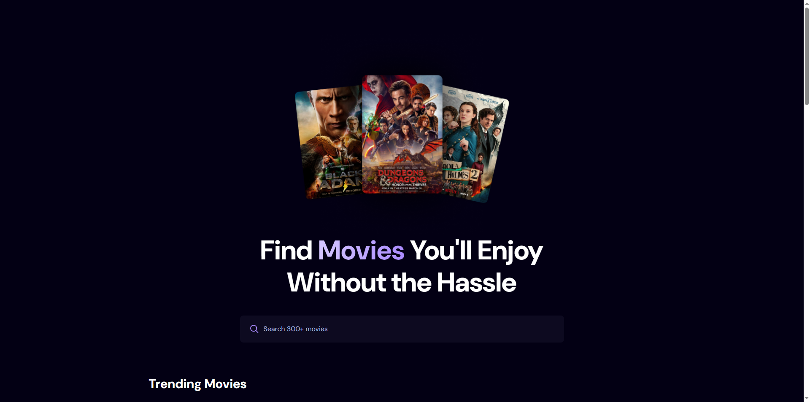
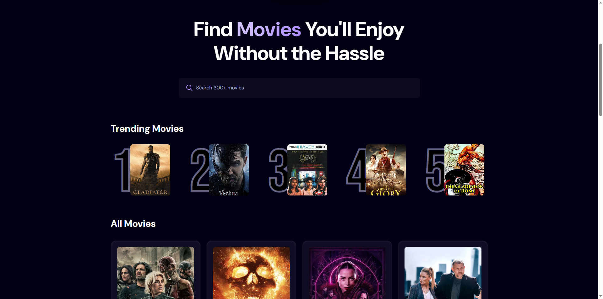

# Search Movies Application
A resposive web application developed on React. User can search for movies. Displays the trending/most searched movies.

Tools used:
- Frontend: React (HTML, Tailwind CSS, JavaScript)
- Backend: Appwrite

API:
- TMDB API

# Sceenshots
    
